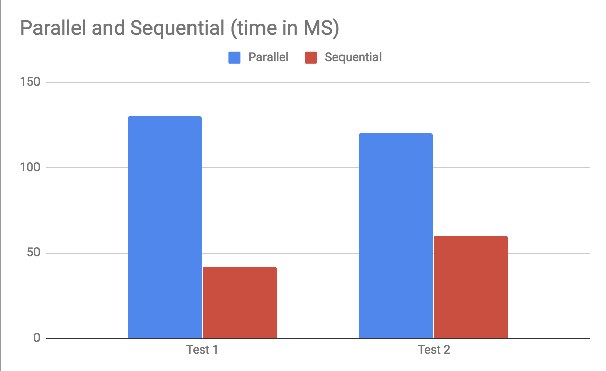

# GPUGraphAlgo
📈📉💹

# How to Run
https://docs.google.com/document/d/1dyYNfk_oiqjokQn-MZSIwO50fQ4di4hk6GTc1xdD9Fc/edit
$ module load gcc/4.9.3  cuda/8.0  cudnn/5.1
$ module load python3
$ pip3 install networkx --user
$ pip3 install Plotly --user

Make a file and directory at this location ~/.plotly/.credentials
If you want to use teams credentials and send the plotly file to this plotly account write this to the file ~/.plotly/.credentials
{
    "proxy_username": "", 
    "stream_ids": [], 
    "username": "cairhart",
    "proxy_password": "", 
    "api_key": "M1xe05p1EUxQqOjg80O4"
}

NOTE: Carter’s Plotly login information:
Email: airhartcarter@gmail.com
popPassword: geGLA235uaKFx3w

Otherwise if you want to see the visualizer you can make your own plotly account. It’s super simple, free, and easy :)

Change the adjacency list in main of connected_comp_parallel.cu to be whatever graph you want to represent. Our adjacency list is in the format of a list of numbers to represent adjacencies for each node and a list of sizes of the number of adjacencies per node. There are two examples below of adjacency lists in the format stated above. 

$ bash bash_batch
$ python3 connected_graph.py
(This will throw up a popup network navigation tool for maverick. You can just control-c to kill it because its already sent to your plotly account!)

The graph should now be on plotly. It should be noted that it takes a few minutes for the plotly graph to update. Just refresh the page and the new graph should be visible. 

# Test Case 1:
	int adj_lists[20] = {1, 2, 0, 3, 0, 3, 1, 2, 5, 4, 7, 8, 6, 10, 6, 9, 10, 8, 7, 8};

    int size = 11;
    int sizes[11] = {2, 2, 2, 2, 1, 1, 2, 2, 3, 1, 2};
Represents a graph with Adjacency List: 
0 1 2 
1 0 3 
2 0 3 
3 1 2 
4 5
5 4
6 7 8 
7 6 10
8 6 9 
9 8
10 7 8 

# Test Case 2
    int adj_lists[16] = {1, 8, 0, 8, 4, 7, 9, 2, 7, 9, 7, 4, 6, 1, 3, 5};

    int size = 10;
    int sizes[10] = {2, 2, 2, 1, 2, 1, 1, 2, 1, 2};    
Represents graph with Adjacency List:
0 1 8
1 0 8
2 4 7
3 9
4 2 7
5 9
6 7 
7 4 6
8 1
9 3 5

#Graph

